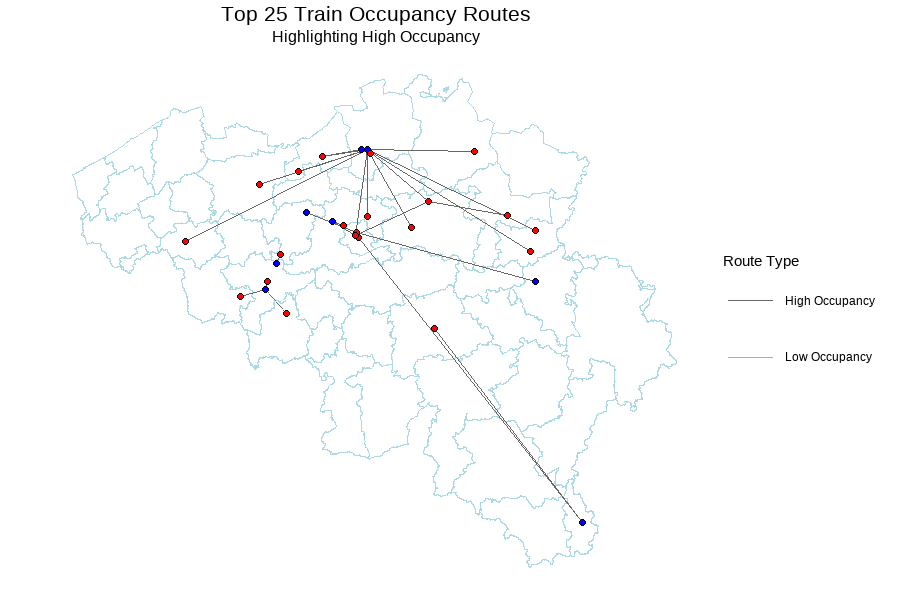

# 1. Introduction

## Background

Nationale Maatschappij der Belgische Spoorwegen (NMBS), or Société nationale des chemins de fer belges (SNCB) is the National Railway Company of Belgium and the largest railway operator in the country. 

The company needs to postpone its expansion due to a shortage of train personnel. Additionally, rising energy costs have increased operating expenses. Meanwhile, the company continues to face revenue losses due to low passenger numbers on some routes.

Given these challenges, the company must develop a strategy to optimize resource allocation, improve operational efficiency, and increase revenue, particularly on low-occupancy routes.

## Purpose

This project aims to provide transportation planners at NMBS with a model called Re-train, which is to predict train occupancy levels for different Origin-Destination (OD) pairs in the Belgian railway system.

## Use Case

While NMBS has an occupancy prediction app for passengers called Move Safe, transportation planners need a more comprehensive tool to forecast occupancy levels across routes and reflect their plan to increase/decrease amount of trains, merge of two similar routes, or decrease the frequent of the route to change low occupancy routes to medium or high.

This tool will help planners make informed decisions on resource allocation, such as train frequency and size, to optimize service quality and efficiency.

## Main Question

1. What was the level of occupancy of a certain OD pair at a specific time in the past? (Modeling and validation of accuracy and generalizability)

2. What is the threshold of level of occupancy that optimize low occupancy and how much is the revenue at that time? (Cost-benefit analysis)

3. What will be future level of occupancy in the future and which options can planners choose option? (Prediction and application to real life)

e.g. decrease amount of trains, merge of two similar routes, or decrease the frequent of the route to change low routes to high

## Methodology

This model uses binomial regression to predict train occupancy (high or low) while identifying key factors that are validated through k-fold cross-validation for robustness.

Also, we will assess the model's predictive accuracy and reliability a confusion matrix, which is shown in the app through accuracy percentage and graph as well.

To minimize the risks of misclassifying high-occupancy routes as low, we set a higher threshold to ensure only routes with a strong likelihood of low occupancy are chosen just like shown on the animation example, It will prioritize service reliability and passenger satisfaction.

# 2. Data Setup

## Load Libraries

We loaded libraries that are required to analyze and visualize the data as shown in the code below.

```{r setup, warning = FALSE, message = FALSE, results = "hide"}
knitr::opts_chunk$set(echo = TRUE)
#install.packages("hms")
#install.packages("BelgiumStatistics", repos = "http://www.datatailor.be/rcube", type = "source")
#install.packages("devtools")
#library(devtools)
#devtools::install_github("jwijffels/BelgiumMaps.Admin", build_vignettes = TRUE)
#devtools::install_github("jwijffels/StatisticsBelgium", build_vignettes = TRUE)
#library(BelgiumStatistics)
#install.packages("gganimate")
library(tidyverse)
library(tidycensus)
library(gganimate)
library(sf)
library(knitr)
library(kableExtra)
library(caret)
library(pscl)
library(mapview)
library(dplyr)
library(scales)
library(viridis)
library(spdep)
library(caret)
library(plotROC)
library(pROC)
library(ckanr)
library(FNN)
library(grid)
library(gridExtra)
library(ggcorrplot)
library(jtools)     # for regression model plots
library(broom)
library(tufte)
library(rmarkdown)
library(pander)
library(classInt)
library(ggplot2)
library(units)
library(leaflet)
library(lubridate)
library(hms)
library(riem) # for weather
library(readxl) # for read xlsx
library(ggtext)
library(showtext) # to set up font in plots
font_add_google("Roboto", "roboto") # to set up font in plots
showtext_auto(TRUE)
library(geosphere) # to calculate distance from two different geolocation (lat, lng)
options(digits = 3, scipen = 999)
source("https://raw.githubusercontent.com/urbanSpatial/Public-Policy-Analytics-Landing/master/functions.r")
colorPallete <- c("low" = "#df543b", "medium" = "#a1b7b8", "high" = "#a1b7b8")
plotTheme <- theme(
  plot.title = element_text(face="bold", hjust = 0, size=15, lineheight=0.8),
  plot.subtitle = element_text(hjust = 0, size = 10, face = "italic", lineheight=0.8, margin = margin(b = 3, t = 6)),  
        plot.caption = element_text(size = 10, hjust = 0, lineheight=0.9),
        plot.margin = margin(1.7, 1.7, 1.7, 1.7),
        text = element_text(family = "roboto"),
        legend.title = element_text(size = 10))

```

## Load Data

We loaded three default data (1)-(3) of NMBS trains, stations, and lines from Kaggle, and four additional data (4)-(7) of Belgium statistical tracts, Belgium population data, zone station data, and weather data from RIEM package.
[1]

(1) Trains dataset (`trains`, `trains_test`, `trains_train`, `trains_trainTest`, `trains_trarinTrain`)

The training dataset of trains provides date, time, origin station code (`from`), destination station code (`to`), vehicle ID, and occupancy information shown at three different levels (low, medium, high), from July 27, 2016 to October 29, 2016.
The test dataset of trains have the same columns as the training dataset, but from October 29, 2016 to December 19, 2016.
The test dataset does not have occupancy level information.

(2) Stations dataset (`stations`)

The stations dataset contains names, locations (longitude and latitude), and average stop times (`avg_stop_times`).
Since NMBS operates trains in Belgium as well as France and the Netherlands, we filtered the dataset to exclude non-Belgian stations (e.g. those in the Netherlands, France, Luxembourg etc.).
Additionally, we created columns to calculate the distance between origin and destination stations, the distance from Belgium to the origin and destination stations, and the bearing between origin and destination stations.

(3) Lines dataset (`line_info`)

The lines dataset includes information about the vehicle ID, vehicle type, the number of stops, and stopping station IDs.
Since the information in the train dataset is insufficient, we did not use stopping station IDs in this analysis.

(4) Belgium statistical tracts dataset (`statBel` and `statBel_muni`)

The Belgium statistical tracts dataset contains the geometries of each tract.
We gained this dataset from Statbel, the Belgian statistical office.
We joined this dataset to calculate the population of Belgium by municipality and intersect this dataset to the stations and the weather stations.

(5) Belgium population dataset (`popBel`)

We assumed that the population of the origin and destination regions would affect the occupancy level of the trains.
We used the Belgium population dataset to calculate the population of Belgium by municipality and joined this dataset to the statistical tracts dataset.

(6) Zone station dataset (`stationZone`)

The zone station dataset contains the zone information of each train station.
At first, we assumed the fare information may be one of the independent variable so we added this information to the stations dataset to calculate the fare.
However, we could not find the opened fare information of NMBS, so we did not use this information in the analysis.

(7) Weather dataset (`weather_belgium`, `weatherstations_with_muni`)

We assumed that the weather conditions of the origin and destination regions at specific dates and times would affect the occupancy level of the trains.
The dataset is from RIEM, which is developed by Iowa Environment Mesonet.
Since RIEM provides global coverage, we were able to get temperature, wind, and relative humidity data from 12 weather stations located in Belgium airports.
Since the percipitation data of Belgium was unavailable in RIEM, we used relative humidity as a substitute variable to reflect general patterns related to precipitation.

```{r loaddata, warning = FALSE, message = FALSE, results = "hide"}
# Load (1) trains, (2) stations, and (3) SNCB lines data
line_info <- read.csv("./Data/line_info.csv") 
trains_test <- read.csv("./Data/trains_test.csv") 
trains_train <- read.csv("./Data/trains_train.csv") 
stations <- read.csv("./Data/stations.csv")

#removing unknown stations and changing null vehicle to undefined
trains_test$vehicle[trains_test$vehicle == "(null)"] <- "undefined"
trains_train <- subset(trains_train, to != "000000000")

# Load (4) Belgium statistical tracts and (5) population data
statBel <- st_read("./Data/sh_statbel_statistical_sectors_3812_20240101.geojson") %>%
  st_transform(4326) 
popBel <- read_excel("./Data/TF_POP_STRUCT_SECTORS_2016.xlsx") # 2016 Belgium population data by tracts

# Load Zone station data to calculate fare
stationZone <- read_excel("./Data/station-zone.xlsx") 

# Filter stations data to exclude non-Belgian stations (Netherlands, France, etc.)
stations <- stations %>%
  filter(country.code=="be")
stations <- left_join(stations, stationZone, by = c("name" = "Station")) # Add zone information to stations)

# Stat tracts and population of Belgium by municipality
statBel_muni <- statBel %>%
  group_by(cd_dstr_refnis) %>%
  summarize(geometry = st_union(geometry)) %>%
  ungroup() 

statBel_muni <- statBel_muni %>%
  left_join(
    statBel %>% st_drop_geometry() %>% select(cd_dstr_refnis, tx_adm_dstr_descr_fr) %>% distinct(),
    by = "cd_dstr_refnis"
  )

popBel_muni <- popBel %>%
  mutate(CD_REFNIS_N = as.character(as.numeric(substr(CD_REFNIS, 1, 2)) * 1000)) %>%
  select(CD_REFNIS_N, POPULATION, TX_DESCR_FR) %>%
  group_by(CD_REFNIS_N) %>%
  summarize(POPULATION = sum(POPULATION)) 

statBel_muni <- left_join(statBel_muni, popBel_muni, by = c("cd_dstr_refnis" = "CD_REFNIS_N"))

# Clean up the URI column to extract the station IDs
stations <- stations %>%
  mutate(station_id = gsub("http://irail.be/stations/NMBS/", "", URI))

# Convert stations dataset to sf object
stations_sf <- stations %>%
  st_as_sf(coords = c("longitude", "latitude"), crs = 4326)
```

## Data Wrangling

We transformed raw data into a more usable format for analysis through the following processs.
First, we combined the training and test datasets, which were initially separated, to manipulate the entire dataset at once.
After we finished the data wrangling, we split them back into training and test sets.

Second, we recoded occupancy data from three levels (low, medium, high) to two levels (low, high).
This was done to focus more on analyzing trends in low occupancy data, and to simplify regression analysis process by using a binomial model instead of a multinomial one.

<Three-level classification of train occupancy>[2]

1. Low: There are plenty of seats left.

2. Medium: It is hard to find a seat and it is difficult to sit together.

3. High: There are no seats left and people have to stand up

<Two-level classification of train occupancy>

1. Low: There are plenty of seats left.

2. High: It is hard to find a seat and it is difficult to sit together or there are no seats left and people have to stand up.

Lastly, we created a panel dataset called `trains` by performing a left_join of internal and external datasets.
This incorporated both dependent and independent variables of the following into one table.
The detailed is as shown in Table 1.

-   Primary internal data: `datetime` (date and time, dbl), `week` (week number, chr), `dotw` (day of week), `interval60` (hourly interval), `from_x` (origin station information, e.g. name, latitude, longitude etc.), `to_x` (destination station information, e.g. name, latitude, longitude etc.), `vehicle` (train number), `occupancy_original` (occupancy of three levels), `occupancy` (occupancy of two levels), `avg_stop_times` (average stop times of each line), `n_stops` (number of stops of each line)

-   Primary external data:

(1) Administration sector: `cd_dstr_refnis` (borough number), `tx_adm_dstr_descr_fr` (name of borough that origin and destination stations are located)

(2) Population: `POPULATION` (population of borough that origin and destination stations are located)

(3) Weather: `temp`, `humid`, `wind` (temperature, humidity, and wind speed of each hour of day at origin and destination stations), `nearest_weather_station` (the nearest weather station location of origin and destination stations)

(4) Event: `event` (weekend and holiday information) Event: 0 = Weekday, 1 = Weekend or holiday

```{r dataset_description, echo = FALSE, warning = FALSE, message = FALSE}
# Create a data frame for the table
dataset_description <- data.frame(
  Variable = c(
    "`from/to`", "`vehicle`", "`occupancy_original`", "`occupancy`", "`interval60`", 
    "`week`", "`datetime`", "`dotw`", "`from/to_station`", "`from/to_avg_stop_times`", 
    "`from/to_lng`", "`from/to_lat`", "`from/to_pop`", "`from/to_cd_dstr_refnis`", 
    "`from/to_tx_adm_dstr_descr_fr`", "`from/to_nearest_weatherstation`", 
    "`from/to_temp`", "`from/to_humid`", "`from/to_wind`", "`vehicle_type`", 
    "`nr_of_stops`", "`event`", "`n_high`", "`n_low`", "`dist_from_O_to_Brussels`", 
    "`dist_from_D_to_Brussels`", "`dist_from_O_to_D`", "`bearing_from_O_to_D`", 
    "`bearing_from_O_to_D_cat`", "`time_cat`", "`date_numeric`", "`time_numeric`", 
    "`occupancy_numeric`"
  ),
  Type = c(
    "<chr>", "<chr>", "<chr>", "<chr>", "<dttm>", 
    "<dbl>", "<dttm>", "<ord>", "<chr>", "<dbl>", 
    "<dbl>", "<dbl>", "<dbl>", "<chr>", 
    "<chr>", "<chr>", 
    "<dbl>", "<dbl>", "<dbl>", "<chr>", 
    "<int>", "<dbl>", "<int>", "<int>", "<dbl>", 
    "<dbl>", "<dbl>", "<dbl>", 
    "<chr>", "<fct>", "<dbl>", "<dbl>", 
    "<dbl>"
  ),
  Description = c(
    "9-digit ID of each origin and destination station", 
    "ID of train", 
    "Train occupancy of three levels (low, medium, high)", 
    "Train occupancy of two levels (low, high)", 
    "Hourly interval", 
    "Week number", 
    "Date and time", 
    "Day of week", 
    "Name of each origin and destination station", 
    "The average number of vehicles stopping each day in this station", 
    "Longitude of each origin and destination station", 
    "Latitude of each origin and destination station", 
    "Population of each origin and destination station", 
    "5-digit borough number that each origin and destination station is located", 
    "Name of a borough that each origin and destination station is located", 
    "4-letter code of the nearest weather station from each origin and destination train station", 
    "Temperature of each origin and destination train station in Celsius", 
    "Relative humidity of each origin and destination train station in percentage", 
    "Wind of each origin and destination train station in meters per second", 
    "4-letter code of vehicle type", 
    "Number of stops of this O-D pair", 
    "Weekend and holiday information (0 = Weekday, 1 = Weekend or holiday)", 
    "Frequency of high occupancy of this O-D pair during Jul-Oct 2016", 
    "Frequency of low occupancy of this O-D pair during Jul-Oct 2016", 
    "Distance from an origin station to Brussels in kilometers", 
    "Distance from a destination station to Brussels in kilometers", 
    "Distance between an origin and a destination station in kilometers", 
    "Bearing angle from an origin to a destination station", 
    "Categorized bearing angle (N, S, E, W, NE, NW, SE, SW)", 
    "Categorized time by commute, morning, noon, evening, midnight", 
    "Numerized date", 
    "Numerized time", 
    "Numerized occupancy (0 = high, 1 = low)"
  )
)

# Create the kable table
kable(dataset_description, "html", col.names = c("Variable", "Type", "Description"), caption = "Table 1. Variable Type and Description") %>%
  kable_styling(full_width = FALSE, bootstrap_options = c("striped", "hover", "condensed"))
```

```{r setup_panel1, warning = FALSE, message = FALSE}
# Change station code from numeric to character and rbind train and test sets
trains_test$from <- as.character(trains_test$from)
trains_test$from <- paste0("00", trains_test$from) 
trains_test$to <- as.character(trains_test$to)
trains_test$to <- paste0("00", trains_test$to) 
trains_test$occupancy <- NA

# Rbind train and test sets
trains <- rbind(trains_train, trains_test)
#trains$occupancy <- factor(trains$occupancy, levels = c("low", "medium", "high"))
# Believe this causes regression error

# Convert date and time to POSIX datetime
trains$datetime <- as.POSIXct(paste(trains$date, trains$time), format = "%Y-%m-%d %I:%M:%S %p")
trains$week <- week(trains$datetime)
trains$dotw <- wday(trains$datetime, label = TRUE)

# Update vehicle ID
trains <- trains %>%
  mutate(vehicle = case_when(
    grepl("^\\d+$", vehicle) & vehicle %in% c("7006", "7966", "8011", "8015") ~ paste0("P", vehicle),
    grepl("^\\d+$", vehicle) ~ paste0("IC", vehicle),
    TRUE ~ vehicle
  ))

# Recode Low-medium-high to Low-high
trains$occupancy_original <- trains$occupancy
trains <- trains %>%
  mutate(occupancy = recode(occupancy, "medium" = "high")) %>%  # (1) Recode medium to high
#  mutate(occupancy = ifelse(occupancy == "medium", NA_character_, occupancy)) %>%
  # (2) Remove medium to high
  mutate(interval60=ymd_h(substr(datetime, 1, 13))) %>%
  mutate(week=week(interval60)) 
```

### (1) Population and Statistical tract data

As of 2016, the population of Belgium is 11,267,910. In Belgium, 43 municipalities (`CD_DSTR_REFNIS`), 589 Reference from National Institute of Statistics Code (`CD_REFNIS`), and 2,882 statistical sectors (`CD_SECTOR`). We performed a left join to add the municipality where the origin and destination stations are located and their population, to the `trains` dataset.

```{r popwrangling, warning = FALSE, message = FALSE}
statBel_muni <- statBel_muni %>%
  mutate(tx_adm_dstr_descr_fr_appr = str_extract(tx_adm_dstr_descr_fr, 
                                  "(?<=Arrondissement d’|Arrondissement de )\\b[\\wÀ-ÿ\\s-]+\\b")) 

ggplot()+
  geom_sf(data = statBel_muni, aes(fill = POPULATION), color = "white")+
  geom_sf_text(
    data = statBel_muni, 
    aes(label = tx_adm_dstr_descr_fr_appr),  
    size = 3,  
    color = "white"  
  ) +
    labs(
    title = "Population of Belgium by Municipality",
    subtitle = "2016",
    caption="Source: StatBel"
  ) +
  theme_void()+plotTheme+
  theme(legend.position = "bottom")
```

```{r joinpop, warning = FALSE, message = FALSE}
stations_with_pop <- st_join(stations_sf, statBel_muni) %>%
  st_drop_geometry()
stations_with_pop <- stations_with_pop %>%
  bind_cols(as.data.frame(st_coordinates(stations_sf))) %>%
  rename(longitude = X, latitude = Y)

# Add from and to station names and left join population into trains data
trains <- trains %>%
  left_join(stations_with_pop, by = c("from" = "station_id")) 
trains <- trains %>%
  select(date, time, from, to, vehicle, occupancy_original, occupancy, interval60, week, datetime, dotw, name, avg_stop_times, longitude, latitude, cd_dstr_refnis, tx_adm_dstr_descr_fr, POPULATION) %>%
  rename(from_station = name) %>%
  rename(from_avg_stop_times = avg_stop_times) %>%
  rename(from_lng = longitude) %>%
  rename(from_lat = latitude) %>%
  rename(from_pop = POPULATION) %>%
  rename(from_cd_dstr_refnis = cd_dstr_refnis) %>%
  rename(from_tx_adm_dstr_descr_fr = tx_adm_dstr_descr_fr)

trains <- trains %>%
  left_join(stations_with_pop, by = c("to" = "station_id")) 
trains <- trains %>%
  select(date, time, from, to, vehicle, occupancy_original, occupancy, interval60, week, datetime, dotw, from_station, from_avg_stop_times, from_lng, from_lat, from_pop, from_cd_dstr_refnis, from_tx_adm_dstr_descr_fr, name, avg_stop_times,  longitude, latitude, cd_dstr_refnis,tx_adm_dstr_descr_fr, POPULATION) %>%
  rename(to_station = name) %>%
  rename(to_avg_stop_times = avg_stop_times) %>%
  rename(to_lng = longitude) %>%
  rename(to_lat = latitude) %>%
  rename(to_pop = POPULATION) %>%
  rename(to_cd_dstr_refnis = cd_dstr_refnis)%>%
  rename(to_tx_adm_dstr_descr_fr = tx_adm_dstr_descr_fr)
```


### (2) Weather data

We assumed that the weather conditions of the origin and destination regions would affect the occupancy level of the trains. We used the weather data from RIEM package to calculate the temperature, relative humidity, and wind speed of each hour of the day at the origin and destination regions. Relative humidity was used as a substitute variable and can reflect general patterns related to precipitation. Also, by spatially intersection, we added a column that shows the nearest weather station from each municipality. Finally, the nearest weather station and the weather data from the nearest weather station was left joined to the `trains` dataset.

```{r joinweather, warning = FALSE, message = FALSE}
# Load weather data
weatherstations_sf <- riem_stations(network = "BE__ASOS") %>% # BE__ASOS = Belgium ASOS (Weather Stations)
  st_as_sf(coords = c("longitude", "latitude"), crs = 4326)
weatherstations <- weatherstations_sf %>% 
  pull(id)
weather_belgium <- data.frame()

for (station in weatherstations) {        # Loop through each station
  weather_data <- riem_measures(          # Fetch data for the current station
    station = station,
    date_start = "2016-07-27",
    date_end = "2016-12-19"
  ) %>%
    select(valid, tmpf, relh, sknt) %>%   # Select relevant columns (timestamp, temperature by Fahrenheit, relative humidity in percentage, wind speed in knots)
    mutate(station_id = station)          # Add a column to identify the station
  weather_belgium <- bind_rows(weather_belgium, weather_data) # Append the fetched data to the main data frame
}

weather_belgium <- weather_belgium %>%
  mutate(interval60 = ymd_h(substr(valid, 1, 13))) %>% # Extract the timestamp and convert it to a POSIXct object
  mutate(week = week(interval60),
         dotw = wday(interval60, label = TRUE)) %>%
  group_by(interval60, station_id) %>%
  summarize(Temp = (max(tmpf, na.rm = TRUE)-32)*5/9, # Temperature by Celsius
            Humid = max(relh, na.rm = TRUE), # relative humidity in percentage
            Wind = max(sknt, na.rm = TRUE)*0.51444) # Wind speed in meters per second

# Convert weather dataset to sf object
weatherstations_with_muni <- st_join(weatherstations_sf, statBel_muni) %>%
  st_drop_geometry()

# Find nearest weather station for municipalities without a station
statBel_muni <- statBel_muni %>%
  mutate(
    weatherstation_within = st_intersects(geometry, weatherstations_sf, sparse = FALSE) %>%
      apply(1, function(x) if (any(x)) weatherstations_sf$id[which(x)[1]] else NA)  # Replace `id` with the column identifying stations
  )
statBel_muni <- statBel_muni %>%
  mutate(
    nearest_weatherstation = ifelse(
      is.na(weatherstation_within),
      weatherstations_sf$id[st_nearest_feature(geometry, weatherstations_sf)],  # Replace `id` with station identifier
      weatherstation_within
    )
  )
statBel_muni <- statBel_muni %>% select(-weatherstation_within)

# left join weather station data into trains data
trains <- trains %>%
  left_join(statBel_muni, by=c("from_cd_dstr_refnis" = "cd_dstr_refnis")) %>%
  rename(from_nearest_weatherstation = nearest_weatherstation) %>%
  select(-geometry, -POPULATION)

trains <- trains %>%
  left_join(statBel_muni, by=c("to_cd_dstr_refnis" = "cd_dstr_refnis")) %>%
  rename(to_nearest_weatherstation = nearest_weatherstation) %>%
  select(-geometry, -POPULATION)

# left join weather data into trains data
trains <- trains %>%
  left_join(weather_belgium, by = c("interval60" = "interval60", "from_nearest_weatherstation" = "station_id")) %>%
  mutate(from_temp = Temp) %>%
  mutate(from_humid = Humid) %>%
  mutate(from_wind = Wind) %>%
  select(-Temp, -Humid, -Wind)  

trains <- trains %>%
  left_join(weather_belgium, by = c("interval60" = "interval60", "to_nearest_weatherstation" = "station_id")) %>%
  mutate(to_temp = Temp) %>%
  mutate(to_humid = Humid) %>%
  mutate(to_wind = Wind) %>%
  select(-Temp, -Humid, -Wind) 

trains <- trains %>%
  mutate(from_humid = case_when(is.infinite(from_humid) ~ NA_real_,
            TRUE ~ from_humid)) %>%
  mutate(to_humid = case_when(is.infinite(to_humid) ~ NA_real_,
            TRUE ~ to_humid))
```

The following map shows the administrative districts of Belgium and the locations of weather stations. 

```{r weather_station_data, warning = FALSE, message = FALSE}
ggplot()+
  geom_sf(data=statBel_muni , fill="#a1b7b8", color="#333")+
  geom_sf(data=weatherstations_sf, color="#df543b", size=1)+
  geom_sf_text(data = statBel_muni ,
               aes(label = tx_adm_dstr_descr_fr_appr),  
               size = 3, color = "black") +
  labs(
    title = "Weather Station Location in Belgium",
        subtitle = "Weather data from RIEM package",
    caption = "Source: StatBel, RIEM package by Maelle Salmon"
  ) +
  theme_void()+plotTheme
```

The following plots show humidity, wind speed, and temperature data by 12 weather stations in Belgium.

```{r weather_data, warning = FALSE, message = FALSE}
grid.arrange(top = "Weather DATA - Belgium - Jul - Dec 2016",
              ggplot(weather_belgium, aes(interval60, Humid)) + geom_line(aes(color=station_id))+plotTheme,
              ggplot(weather_belgium, aes(interval60, Wind)) + geom_line(aes(color=station_id))+plotTheme,
              ggplot(weather_belgium, aes(interval60, Temp)) + geom_line(aes(color=station_id))+plotTheme)
```

### (3) Vehicle data

Train types in Belgium is as the following.[3] In this analysis, we removed "EUR", "ICE", "ICT", "TGV", "TRN", and other undefined vehicle code.

InterCity (IC): IC trains connect Belgium’s large cities.
These trains only stop at the biggest train stations and sometimes cross international borders.

Peak (P): P trains run during peak travel times.
They provide additional alternatives when you’re travelling during busy periods.
Most of these trains run in the mornings and in late afternoon.

Local trains (L): L trains generally connect cities, but they also stop at every station along the route.

S-trains (S): S trains are suburban trains that connect the city centre with the surrounding communes.
S trains stop in most stations along the route.

EXTRA: Additional train services, used at exceptionally busy periods.
For example, these are the trains that travel towards the Belgian coast on very sunny days.

T (Touristic): Additional train service to certain tourist destinations.

EXP (Coast Express): Extra train service to the Belgian coast during the summer period.
International trains (INT = EC, THA, TGV, ICE, EST): Regular international trains, namely Eurocity, Thalys, TGV, ICE and Eurostar.

```{r setup_panel2, warning = FALSE, message = FALSE, results = "hide"}
# Left join line_data into trains data
trains <- trains %>%
   left_join(line_info, by = c("vehicle" = "vehicle_id")) 

# Clean up vehicle type
trains <- trains %>%
  mutate(
    vehicle_type = ifelse(
      is.na(vehicle_type) | vehicle_type == "",  
      gsub("[0-9]", "", vehicle),           
      vehicle_type                          
    )
  )
trains <- trains %>%
  mutate(vehicle_type = case_when(
    vehicle_type == "ic" & row_number() == min(which(vehicle_type == "ic")) ~ "IC",
    TRUE ~ vehicle_type
  ))
trains <- trains %>%
  mutate(vehicle = case_when(
    vehicle == "ic2029" & row_number() == min(which(vehicle == "ic2029")) ~ "IC2029",
    TRUE ~ vehicle
  ))

# Filter few vehicle_type
trains <- trains %>%
  filter(!(vehicle_type %in% c("EUR", "ICE", "ICT", "TGV", "TRN", "THA", "undefined", "(null)")))


```

### (4) Event data

```{r event, warning = FALSE, message = FALSE}
# Create event data for weekends and holidays
trains <- trains %>%
  mutate(event = case_when(dotw == "Sat" ~ 1,
                           dotw == "Sun" ~ 1,
                           ymd(interval60) >= "2016-07-28" & ymd(interval60) <= "2016-09-04" ~ 1,
                           ymd(interval60) == "2016-11-03" | ymd(interval60) == "2016-11-04" | ymd(interval60) == "2016-11-05" ~ 1,
                           ymd(interval60) == "2016-11-13" | ymd(interval60) == "2016-11-14" | ymd(interval60) == "2016-11-15" ~ 1,
                           TRUE ~ 0))
```

### (5) Distance and Bearing Angle from Origin to Destination

```{r frequency, warning = FALSE, message = FALSE, results = "hide"}


# Calculate the distance from O to Brussels, from D to Brussels, and from O to D in kilometers
trains <- trains %>%
  mutate(
    dist_from_O_to_Brussels = pmap_dbl(
      list(from_lng, from_lat), 
      ~ distHaversine(c(4.3517, 50.8503), c(..1, ..2)) / 1000
    ),
    dist_from_D_to_Brussels = pmap_dbl(
      list(to_lng, to_lat),
      ~ distHaversine(c(4.3517, 50.8503), c(..1, ..2)) / 1000
    ),
    dist_from_O_to_D = pmap_dbl(
      list(from_lng, from_lat, to_lng, to_lat),
      ~ distHaversine(c(..1, ..2), c(..3, ..4)) / 1000
    )
  )

# Calculate the bearing angle from O to D
deg2rad <- function(deg) {
  return(deg * pi / 180)
}
rad2deg <- function(rad) {
  return(rad * 180 / pi)
}
calculate_bearing <- function(lat1, lon1, lat2, lon2) {
  phi1 <- deg2rad(lat1)
  phi2 <- deg2rad(lat2)
  delta_lambda <- deg2rad(lon2 - lon1)
  
  theta <- atan2(
    sin(delta_lambda) * cos(phi2),
    cos(phi1) * sin(phi2) - sin(phi1) * cos(phi2) * cos(delta_lambda)
  )
  
  bearing <- (rad2deg(theta) + 360) %% 360
  return(bearing)
}

trains$bearing_from_O_to_D <- calculate_bearing(trains$from_lat, trains$from_lng, trains$to_lat, trains$to_lng)

trains$bearing_from_O_to_D_cat <- case_when(
  trains$bearing_from_O_to_D >= 337.5 | trains$bearing_from_O_to_D < 22.5 ~ "N",
  trains$bearing_from_O_to_D >= 22.5 & trains$bearing_from_O_to_D < 67.5 ~ "NE",
  trains$bearing_from_O_to_D >= 67.5 & trains$bearing_from_O_to_D < 112.5 ~ "E",
  trains$bearing_from_O_to_D >= 112.5 & trains$bearing_from_O_to_D < 157.5 ~ "SE",
  trains$bearing_from_O_to_D >= 157.5 & trains$bearing_from_O_to_D < 202.5 ~ "S",
  trains$bearing_from_O_to_D >= 202.5 & trains$bearing_from_O_to_D < 247.5 ~ "SW",
  trains$bearing_from_O_to_D >= 247.5 & trains$bearing_from_O_to_D < 292.5 ~ "W",
  trains$bearing_from_O_to_D >= 292.5 & trains$bearing_from_O_to_D < 337.5 ~ "NW"
)
```

### (6) Time categorization

The following plot shows a distribution between high and low occupancy levels by hour of the day.
The train schedule was concentrated at 06:00-08:59 and 16:00-19:59.
This result corresponds to the typical rush hour in Belgium, which is 08:00-17:00.
Despite the large number of trains in this time zone, the low occupancy rate was low at around 33%.
However, the low occupancy rate was about 62% at 10:00-14:59.

```{r cattime, warning = FALSE, message = FALSE}
# Categorize time
time_category <- function(time) {
  hour <- as.numeric(format(time, "%H"))
  if ((hour >= 6 & hour < 9) | (hour >= 16 & hour < 20)) {
    return("commute time")
  } else if (hour >= 0 & hour < 6) {
    return("morning")
  } else if (hour >= 9 & hour < 16) {
    return("noon")
  } else {
    return("evening")
  }
}

trains <- trains %>%
  mutate(time_cat = sapply(datetime, time_category))
trains$time_cat <- factor(trains$time_cat, levels = c( "morning", "commute time", "noon", "evening"))
```

# 3. Exploratory Data Analysis

## Location of Stations

The map below shows the location of 567 train stations in Belgium. The colored stations are primary stations that represents each zone. SNCB operates trains in Belgium as well as France and the Netherlands, but we filtered the dataset to exclude non-Belgian stations (e.g. those in the Netherlands, France, Luxembourg etc.) in this analysis. 

```{r station_map, warning = FALSE, message = FALSE}
# Create a leaflet map
pal <- colorFactor(
  palette = "Set1",  
  domain = stations_sf$Zone  
)

leaflet(stations_sf) %>%
  addTiles() %>%
  addCircleMarkers(
    label = ~name,
    radius = 2,
    color = ~pal(Zone),
    fillOpacity = 0.9
  ) %>%
  addLegend("bottomright", pal=pal, values=~Zone, labels = "Stations", title = "Station Map")

```

## Distribution of Train Occupancy Levels

Trains data from July to October 2016 shows that more than 40% of trains had low occupancy as shown below.

```{r occ_distribution, warning = FALSE, message = FALSE}
# Occupancy distribution
trains %>%
  subset(!is.na(occupancy)) %>%
  count(occupancy) %>%
  ggplot(aes(x = occupancy, y = n, fill = occupancy)) +
  geom_bar(stat = "identity") +
  geom_text(
    aes(label = paste0(n, " (", round(n / sum(n) * 100, 1), "%)")), 
    vjust = -0.5  
  ) +
  scale_fill_manual(values = colorPallete) +
  labs(
    title = "Distribution of Train Occupancy Levels",
    subtitle = "Training data, July - Oct 2016",
    x = "Occupancy Level",
    y = "Count of Trains"
  ) +
  theme_minimal()+plotTheme+
  theme(legend.position = "none")

```

## Distribution of Train Occupancy Levels by Time Trend

### (1) Train Occupancy Trend by Hour of the Day

The following plot shows a distribution between high and low occupancy levels by hour of the day.
The train schedule was concentrated at 06:00-08:59 and 16:00-19:59.
This result corresponds to the typical rush hour in Belgium, which is 08:00-17:00.
Despite the large number of trains in this time zone, the low occupancy rate was low at around 33%.
However, the low occupancy rate was about 62% at 10:00-14:59.

```{r occ_trend1, warning = FALSE, message = FALSE}
# Time trend
trains %>%
  subset(!is.na(occupancy)) %>%
  group_by(hour = hour(datetime), occupancy) %>%
  count()  %>%
  ggplot(aes(x = factor(hour), y = n, fill = occupancy)) +  
  geom_bar(stat = "identity") +  
  geom_text(
    aes(label = paste0(n)),
    position = position_stack(vjust = 0.5)
  ) +
  scale_fill_manual(values = colorPallete) +  
  labs(
    title = "Train Occupancy Trend by Hour of the Day",
    subtitle = "Training data, July - Oct 2016",
    x = "Hour of Day",
    y = "Count of Trains",
    fill = "Occupancy Level"
  ) +
  theme_minimal()+plotTheme+
  theme(legend.position = "bottom")

sum_trains <- trains %>%
  subset(!is.na(occupancy)) %>%
  group_by(hour = hour(datetime), occupancy) %>%
  count() %>%
  pivot_wider(names_from = occupancy, values_from = n, values_fill = 0) %>%  
  mutate(
    ratio = low / (low + high),  
    total = low + high           
  )

```

```{r occ_trend2, warning = FALSE, message = FALSE}
trains %>%
  subset(!is.na(occupancy)) %>%
  group_by(hour = hour(datetime)) %>%
  count(occupancy) %>%
  ggplot(aes(x = hour, y = n, color = occupancy)) +
  geom_line() +
  scale_color_manual(values = colorPallete) +
  labs(
    title = "Train Occupancy Trend by Hour of the Day",
        subtitle = "Training data, July - Oct 2016",
    x = "Hour of Day",
    y = "Count"
  ) +
  theme_minimal()+plotTheme+
  theme(legend.position = "bottom")
```

### (2) Train Occupancy Trend by Day of Week

The proportion of low occupancy routes on weekdays is lower than on weekends.
According to the plot below, the average rate of low occupancy routes is 40.7% on weekdays (Monday to Friday), while 43.8% on weekends (Saturday and Sunday).

```{r occ_trend3, warning = FALSE, message = FALSE}
trains %>%
  subset(!is.na(occupancy)) %>%
  mutate(date = as.Date(datetime)) %>%  
  group_by(dotw, occupancy) %>%
  count() %>%
  ggplot(aes(x = dotw, y = n, fill=occupancy)) +  # Use color for lines
  geom_bar(stat = "identity") + 
   geom_text(
    aes(label = paste0(n)),
    position = position_stack(vjust = 0.5)
  ) +
  scale_fill_manual(values = colorPallete) +  
  labs(
    title = "Train Occupancy Trend by Day of Week",
    subtitle = "Training data, July - Oct 2016",
    x = "Day",
    y = "Count of Trains",
    color = "Occupancy Level"
  ) +
  theme_minimal()+plotTheme+
  theme(legend.position = "bottom")

sum_trains2 <- trains %>%
  subset(!is.na(occupancy)) %>%
  group_by(dotw, occupancy) %>%
  count() %>%
  pivot_wider(names_from = occupancy, values_from = n, values_fill = 0) %>%  
  mutate(
    ratio = low / (low + high),  
    total = low + high           
  )
```

```{r occ_trend4, warning = FALSE, message = FALSE}
trains %>%
  subset(!is.na(occupancy)) %>%
  mutate(date = as.Date(datetime)) %>%  
  group_by(dotw, occupancy) %>%
  summarise(n = n(), .groups = "drop") %>%  # Use summarise instead of count
  ggplot(aes(x = dotw, y = n, color = occupancy, group = occupancy)) +
  geom_line(size = 1) +
  scale_color_manual(values = colorPallete) +  
  labs(
    title = "Train Occupancy Trend by Day of Week",
            subtitle = "Training data, July - Oct 2016",
    x = "Day",
    y = "Count of Trains",
    color = "Occupancy Level"
  ) +
  theme_minimal()+plotTheme+
  theme(legend.position = "bottom")
```

### (3) Train Occupancy Trend by Date

When comparing the `trains` data from mid-August to mid-September with the data from mid-September to the end of October, we observed that the number of record is significantly different.
One possible reason we guess is missing data.
Another reason could be that SNCB holiday period from the end of July to end of August, during which certain IC, S and P trains do not run, so that there is possibly a reduced number of trains during this period.[4]
In this analysis, we assumed that there were no missing data, and set event as 1 for the date of holiday period as well as weekends and public holidays.


```{r occ_trend5, warning = FALSE, message = FALSE}
trains %>%
  subset(!is.na(occupancy)) %>%
  mutate(date = as.Date(datetime)) %>%  
  group_by(date, hour = hour(datetime), occupancy) %>%
  count() %>%
  ggplot(aes(x = date, y = n, fill=occupancy)) +  # Use color for lines
  geom_bar(stat = "identity") +  # Stacked bar chart
  scale_fill_manual(values = colorPallete) +  
  labs(
    title = "Train Occupancy Trend by Date",
    subtitle = "Training data, July - Oct 2016",
    x = "Date and Hour",
    y = "Count of Trains",
    color = "Occupancy Level"
  ) +
  theme_minimal()+plotTheme+
  theme(legend.position = "bottom")

sum_trains3 <- trains %>%
  subset(!is.na(occupancy)) %>%
  group_by(date, dotw, occupancy) %>%
  count() %>%
  pivot_wider(names_from = occupancy, values_from = n, values_fill = 0) %>%  
  mutate(
    ratio = low / (low + high),  
    total = low + high           
  ) %>%
  filter(total >=5)
```

```{r occ_trend6, warning = FALSE, message = FALSE}
trains %>%
  subset(!is.na(occupancy)) %>%
  group_by(date = date(datetime)) %>%
  count(occupancy) %>%
  ggplot(aes(x = date, y = n, color = occupancy)) +
  geom_line() +
  scale_color_manual(values = colorPallete) +
  labs(
    title = "Train Occupancy Trend by Date",
        subtitle = "Training data, July - Oct 2016",
    x = "Date",
    y = "Count"
  ) +
  theme_minimal()+plotTheme+
  theme(legend.position = "bottom")
```

In sum, most prominent low occupancy routes are during off-peak hours, on weekends, and scattered throughout the date on early July-August.
Meanwhile, high occupancy routes are strong during commuter hour, on weekdays, and on mid-late October.

## Distribution of Train Occupancy Levels by OD Pairs

The following (1)-(4) are the distribution of train occupancy levels by origin and destination (OD) pairs. 

### (1) Top 25 Count of Trains OD Pairs

```{r top25, warning = FALSE, message = FALSE}
# Filter high occupancy
high_occupancy <- trains %>% subset(!is.na(occupancy)) %>%
  filter(occupancy == "high") %>%
  count(from_station, to_station) %>%
  arrange(desc(n)) %>%
  rename(n_high = n)

low_occupancy <- trains %>% subset(!is.na(occupancy)) %>%
  filter(occupancy == "low") %>%
  count(from_station, to_station) %>%
  arrange(desc(n))%>%
  rename(n_low = n)

# Create and left join the frequency (count) of high and low occupancy data of origin and destination station by each OD pair
trains <- trains %>%
  left_join(high_occupancy, by = c("from_station" = "from_station", "to_station" = "to_station")) 
trains <- trains %>%
  left_join(low_occupancy, by = c("from_station" = "from_station", "to_station" = "to_station")) 

occupancy <- high_occupancy %>%
  left_join(low_occupancy, by = c("from_station" = "from_station", "to_station" = "to_station")) 

occupancy_data <- trains %>%
  subset(!is.na(occupancy)) %>%
  count(from_station, to_station, occupancy) %>%
  group_by(from_station, to_station) %>%
  mutate(total = sum(n)) 

occupancy_data %>%
  filter(!is.na(to_station)) %>%
   ungroup() %>% 
  arrange(desc(total)) %>%
  slice_head(n = 70) %>%  # Top 70 OD pairs
  ggplot(aes(
    x = reorder(paste(from_station, to_station, sep = " → "), total),
    y = n,
    fill = occupancy
  )) +
  geom_bar(stat = "identity") +  # Stacked bar chart
  coord_flip() +
  scale_fill_manual(values = colorPallete) +  
  labs(
    title = "Top 25 Count of Trains OD Pairs",
    subtitle = "Training data, July - Oct 2016",
    x = "OD Pair",
    y = "Count of Trains",
    fill = "Occupancy Level"
  ) +
  theme_minimal()+plotTheme+
  theme(legend.position = "bottom")

```

### (2) Top 10 High Occupancy Count of Trains OD Pairs

```{r top10high, warning = FALSE, message = FALSE}
# Plot top 10 OD pairs with high occupancy
high_occupancy %>%
  filter(!is.na(to_station)) %>%
  head(10) %>%
  ggplot(aes(x = reorder(paste(from_station, to_station, sep = " → "), n_high), y = n_high)) +
  geom_bar(stat = "identity", fill = "#a1b7b8") +
  coord_flip() +
  labs(
    title = "Top 10 High-Occupancy OD Pairs",
    subtitle = "Training data, July - Oct 2016",
    x = "OD Pair",
    y = "Count"
  ) +
  theme_minimal()+plotTheme
```

### (3) Top 10 Low Occupancy Count of Trains OD Pairs

```{r top10low, warning = FALSE, message = FALSE}
# Plot top 10 OD pairs with low occupancy
low_occupancy %>%
  filter(!is.na(to_station)) %>%
  head(10) %>%
  ggplot(aes(x = reorder(paste(from_station, to_station, sep = " → "), n_low), y = n_low)) +
  geom_bar(stat = "identity", fill = "#df543b") +
  coord_flip() +
  labs(
    title = "Top 10 Low-Occupancy OD Pairs",
    subtitle = "Training data, July - Oct 2016",
    x = "OD Pair",
    y = "Count"
  ) +
  theme_minimal()+plotTheme
```


### (4) Top 25 Low Occupancy Percentage OD Pairs

```{r top25lowperc, warning = FALSE, message = FALSE}
# Plot top 25 OD pairs with low occupancy percentage
high_occupancy %>%
  left_join(low_occupancy, by = c("from_station" = "from_station", "to_station" = "to_station")) %>%
  filter(!is.na(to_station)) %>%
  mutate(perc = n_low/(n_high+n_low)*100) %>%
  arrange(desc(perc))%>%
  head(25) %>%
  ggplot(aes(x = reorder(paste(from_station, to_station, sep = " → "), perc), y = perc)) +
  geom_bar(stat = "identity", fill = "#df543b") +
  coord_flip() +
  labs(
    title = "Top 25 Low-Occupancy Percentage OD Pairs",
    subtitle = "Training data, July - Oct 2016",
    x = "OD Pair",
    y = "Percentage of Low Occupancy (%)") +
  theme_minimal()+plotTheme
```

```{r lowcounts, warning = FALSE, message = FALSE}
# Visualize distribution 

ggplot(low_occupancy, aes(x = n_low)) +
  geom_histogram(binwidth = 1, fill = "#df543b", color = "white") +
  labs(
    title = "Distribution of Low Occupancy Counts",
    x = "Count (n)",
    y = "Frequency"
  ) +
  theme_minimal()+plotTheme
```
 
### (5) Time/Space Analysis

```{r mapviz, warning = FALSE, message = FALSE}
# Prepare data
routes_data <- trains %>%
  subset(!is.na(occupancy)) %>%
  group_by(from_station, to_station, from_lat, from_lng, to_lat, to_lng) %>%
  summarize(high_count = sum(occupancy == "high"), 
            low_count = sum(occupancy == "low"), .groups = "drop") %>%
  mutate(total = high_count + low_count,
         high_rate = high_count / total * 100,
         low_rate = low_count / total * 100)

# Top 25 highest occupancy rate routes
highest_occupancy <- routes_data %>%
  arrange(desc(high_rate)) %>%
  slice_head(n = 25)

# Top 25 lowest occupancy rate routes
lowest_occupancy <- routes_data %>%
  arrange(desc(low_rate)) %>%
  slice_head(n = 25)

# Combine datasets and add animation frame
# Clean animation data and ensure valid geometries
animation_data <- highest_occupancy %>%
  mutate(type = "High Occupancy", frame = 1) %>%
  bind_rows(
    lowest_occupancy %>% mutate(type = "Low Occupancy", frame = 2)
  ) %>%
  filter(
    !is.na(from_lat), !is.na(from_lng),
    !is.na(to_lat), !is.na(to_lng)
  ) %>%
  rowwise() %>%
  mutate(
    geometry = st_sfc(
      st_linestring(matrix(c(from_lng, from_lat, to_lng, to_lat), ncol = 2, byrow = TRUE)),
      crs = 4326
    )
  ) %>%
  st_as_sf()

# Base map with `statBel_muni`
base_map <- ggplot() +
  geom_sf(data = statBel_muni, aes(fill = tx_adm_dstr_descr_fr_appr), color = "lightblue", size = 0.2) +
  scale_fill_manual(values = rep("white", length(unique(statBel_muni$tx_adm_dstr_descr_fr_appr)))) + # Set all regions to white
  guides(fill = "none") + # Remove legend for the background
  theme_minimal() +
  theme(
    panel.background = element_rect(fill = "white", color = NA),  # White background
    panel.grid = element_blank(),  # Remove grid lines
    axis.text = element_blank(),  # Remove axis text
    axis.ticks = element_blank(),  # Remove axis ticks
    axis.title = element_blank(),  # Remove axis titles
    plot.title = element_text(size = 16, face = "bold", hjust = 0.5),  # Centered title
    plot.subtitle = element_text(size = 12, hjust = 0.5)  # Centered subtitle
  )

points_data <- animation_data %>%
  st_drop_geometry() %>%
  rowwise() %>%
  mutate(
    origin_geom = st_sfc(st_point(c(from_lng, from_lat)), crs = 4326),
    destination_geom = st_sfc(st_point(c(to_lng, to_lat)), crs = 4326)
  ) %>%
  st_as_sf()

# Animated map with routes and points
animated_map <- base_map +
  # Plot routes
  geom_sf(data = animation_data, aes(geometry = geometry, color = type), size = 20) + # Thick lines
  # Plot origin points
  geom_sf(data = points_data, aes(geometry = origin_geom), shape = 21, fill = "blue", size = 3, color = "black") +
  # Plot destination points
  geom_sf(data = points_data, aes(geometry = destination_geom), shape = 21, fill = "red", size = 3, color = "black") +
  # Scale for line colors
  scale_color_manual(
    values = c(
      "High Occupancy" = "grey40",   # Bold grey for high occupancy
      "Low Occupancy" = "orange"    # Bold orange for low occupancy
    )
  ) +
  labs(
    title = "Top 25 Train Occupancy Routes",
    subtitle = "Highlighting {closest_state}",
    color = "Route Type"
  ) +
  transition_states(type, transition_length = 2, state_length = 2) +
  ease_aes('linear')

# Save the animation as a GIF
#animate(animated_map, nframes = 100, fps = 10, width = 900, height = 600, #renderer = gifski_renderer("occupancy_routes_with_points.gif"))
```





The provided map visualization represents the top 25 train occupancy routes based on occupancy level. Based on the map, high occupancy is concentrated on major intercity and commuter routes. Meanwhile, smaller or regional routes shows reduced demand. But there are two quite big OD Pairs that dominate low-occupancy, possibly indicating a mismatch in train frequency with actual demand.

## Other Feature Associations with the Likelihood of Occupancy Level

### (1) Continuous Variables: Average Stop Times, Number of Stops

In the first analysis of continuous variables, we found that the number of stops does not vary significantly not that much different among the likelihood of occupancy level, and average stop times of low occupancy OD pairs are shorter than those of high occupancy ones.

```{r contvar, warning = FALSE, message = FALSE}
trains %>%
  filter(!is.na(occupancy)) %>% 
  select(occupancy, from_avg_stop_times, to_avg_stop_times, nr_of_stops) %>%
  gather(Variable, value, -occupancy) %>%
  ggplot(aes(occupancy, value, fill=occupancy)) +
  geom_bar(position="dodge", stat="summary", fun="mean") +
  facet_wrap(~Variable, scales="free") +
  scale_fill_manual(values=colorPallete) +
  labs(x="Occupancy", y="Mean", 
       title="Feature associations with the likelihood of occupancy Level",
       subtitle="Average stop times of origin and destination station and the number of stops of each line\nTraining data, July - Oct 2016", 
       caption="Source: Kaggle")+
  theme_minimal()+plotTheme+
  theme(legend.position="none")
```

### (2) Continuous Variables: Population of Origin and Destination Station

The average population of each origin and destination station may affect the likelihood of occupancy level. The average population of the destination station was higher for high-occupancy pairs than for low-occupancy pairs, while the average population of the origin station was not significantly different.

```{r contvar1, warning = FALSE, message = FALSE}
trains %>%
  filter(!is.na(occupancy)) %>% 
  select(occupancy, from_pop, to_pop) %>%
  gather(Variable, value, -occupancy) %>%
  ggplot(aes(occupancy, value, fill=occupancy)) +
  geom_bar(position="dodge", stat="summary", fun="mean") +
  facet_wrap(~Variable, scales="free") +
  scale_fill_manual(values=colorPallete) +
  labs(x="Occupancy", y="Mean", 
       title="Feature associations with the likelihood of occupancy Level",
       subtitle="Average population of origin and destination station\nTraining data, July - Oct 2016", 
       caption="Source: Kaggle")+
  theme_minimal()+plotTheme+
  theme(legend.position="none")
```

### (3) Continuous Variables: Temperature, Relative Humidity, Wind Speed of Origin and Destination Station

The third analysis of continuous variables examines temperature, relative humidity, and wind speed at the origin and destination stations. Although the difference was small, high-occupancy pairs had higher relative humidity compared to low-occupancy pairs, while temperature and wind speed were lower for high-occupancy pairs than for low-occupancy pairs.

```{r contvar2, warning = FALSE, message = FALSE}
trains %>%
  filter(!is.na(occupancy)) %>% 
  select(occupancy, from_wind, to_wind, from_temp, to_temp, from_humid, to_humid) %>%
  gather(Variable, value, -occupancy) %>%
  ggplot(aes(occupancy, value, fill=occupancy)) +
  geom_bar(position="dodge", stat="summary", fun="mean") +
  facet_wrap(~Variable, scales="free") +
  scale_fill_manual(values=colorPallete) +
  labs(x="Occupancy", y="Mean", 
       title="Feature associations with the likelihood of occupancy Level",
       subtitle="Temperature and wind of origin and destination station\nTraining data, July - Oct 2016", 
       caption="Source: Kaggle")+
  theme_minimal()+plotTheme+
  theme(legend.position="none")
```

### (4) Continuous Variables: Distance from Origin to Destination, Origin to Brussels, Destination to Brussels

The fourth analysis of continuous variables is about the distance from O to D, O or D to Belgium. The distance in this paragraph (3) and the below (4) bearing information were calculated to represent the spatial relationship between O and D in the binomial regression model. For low-occupancy trips, the distance from either O or D to Brussels was longer, while the distance between O and D was shorter.

```{r contvar3, warning = FALSE, message = FALSE}
trains %>%
  filter(!is.na(occupancy)) %>% 
  select(occupancy, dist_from_O_to_D, dist_from_O_to_Brussels, dist_from_D_to_Brussels) %>%
  gather(Variable, value, -occupancy) %>%
  ggplot(aes(occupancy, value, fill=occupancy)) +
  geom_bar(position="dodge", stat="summary", fun="mean") +
  facet_wrap(~Variable, scales="free") +
  scale_fill_manual(values=colorPallete) +
  labs(x="Occupancy", y="Mean distance (km)", 
       title="Feature associations with the likelihood of occupancy Level",
       subtitle="Distance from O, D to Brussels, and from O to D\nTraining data, July - Oct 2016", 
       caption="Source: Kaggle")+
  theme_minimal()+plotTheme+
  theme(legend.position="none")
```

### (5) Categorical Variables: Bearing Angle Direction from Origin to Destination

With the bearing angle direction from Origin to Destination data, it is possible to identify which directional routes have a higher distribution of low occupancy. High occupancy had a higher count in all directions, but the difference in count between high and low occupancy was particularly significant in the east, west, and southeast directions.

```{r catvar, warning = FALSE, message = FALSE}
trains %>%
  filter(!is.na(occupancy)) %>% 
  select(occupancy, bearing_from_O_to_D_cat) %>%
  gather(Variable, value, -occupancy) %>%
  count(Variable, value, occupancy) %>%
  ggplot(aes(occupancy, n, fill=occupancy)) +
  geom_bar(position="dodge", stat="summary") +
  ylim(0,250)+
  facet_wrap(~value, scales="free") +
  scale_fill_manual(values=colorPallete) +
  labs(x="Occupancy", y="Count", 
       title="Feature associations with the likelihood of low occupancy",
       subtitle="Bearing Angle Direction from Origin to Destination\nTraining data, July - Oct 2016", 
       caption="Source: Kaggle")+
  theme_minimal()+plotTheme+
  theme(legend.position="none")
```


### (6) Binomial Variables: Event

As mentioned above in 2.(4), we assigned `event` a value of 1 for weekends and public holidays. The difference in the count between high and low occupancy during weekends and public holidays (`event` == 1) was smaller than on weekdays (`event` == 0). 

```{r bivar, warning = FALSE, message = FALSE}
trains %>%
  filter(!is.na(occupancy)) %>% 
  select(occupancy, event) %>%
  gather(Variable, value, -occupancy) %>%
  count(Variable, value, occupancy) %>%
  ggplot(aes(occupancy, n, fill=occupancy)) +
  geom_bar(position="dodge", stat="summary") +
  facet_wrap(~value, scales="free") +
  scale_fill_manual(values=colorPallete) +
  ylim(0,1200)+
  labs(x="Occupancy", y="Count", 
       title="Feature associations with the likelihood of low occupancy",
       subtitle="Event: 0 = Weekday,  1 = Weekend or holiday\nTraining data, July - Oct 2016", 
       caption="Source: Kaggle")+
  theme_minimal()+plotTheme+
  theme(legend.position="none")
```

### (7) Categorical Variables: Time category

The time periods were categorized as follows:
	•	“0600-0900 and 1600-2000” as commute,
	•	“2000-2400” as evening,
	•	“0000-0600” as morning,
	•	“0900-1600” as noon.

For the training data from July to October 2016, it was evident that the count of high occupancy was greater during commute times, whereas low occupancy was more prevalent during the noon period.

```{r catvar2, warning = FALSE, message = FALSE}
trains %>%
  filter(!is.na(occupancy)) %>% 
  select(occupancy, time_cat) %>%
  gather(Variable, value, -occupancy) %>%
  count(Variable, value, occupancy) %>%
  ggplot(aes(occupancy, n, fill=occupancy)) +
  geom_bar(position="dodge", stat="summary") +
  ylim(0,1000)+
  facet_wrap(~value, scales="free") +
  scale_fill_manual(values=colorPallete) +
  labs(x="Occupancy", y="Count", 
       title="Feature associations with the likelihood of low occupancy",
       subtitle="0600-0900 and 1600-2000 commute, 2000-2400 evening, 0000-0600 morning, 0900-1600 noon\nTraining data, July - Oct 2016", 
       caption="Source: Kaggle")+
  theme_minimal()+plotTheme+
  theme(legend.position="none")
```

Additionally, the following plot shows the distribution of low occupancy ratios by time category of each day. The low occupancy rate was higher in the morning of Thursday, Friday, and Saturday, and noon of Monday, Tuesday, and Wednesday. During the commute time, the ratio of low occupancy was low except Saturday.

```{r catvar3, warning = FALSE, message = FALSE}
train_summary <- trains %>%
  filter(!is.na(occupancy)) %>% 
  group_by(dotw, time_cat) %>%
  summarize(
    total_count = n(),  
    low_count = sum(occupancy == "low", na.rm = TRUE),  
    low_ratio = low_count / total_count*100  
  ) %>%
  ungroup()

ggplot(train_summary, aes(x = dotw, y = low_ratio, fill=time_cat)) +
  geom_bar(stat = "identity", position = "dodge") +  
  scale_fill_manual(
    values = c(
      "morning" = "#1f78b4",      
      "commute time" = "#33a02c", 
      "noon" = "#e31a1c",         
      "evening" = "#ff7f00",      
      "midnight" = "#6a3d9a"      
    )
  ) +
  labs(
    title="Feature associations with the likelihood of occupancy Level",
    subtitle="Low occupancy rate by time category of each day\nTraining data, July - Oct 2016", 
    x = "Day of Week",
    y = "Low occupancy rate (%)", 
    caption="Source: Kaggle"
  ) +
  theme_minimal() +
  theme(legend.position = "bottom")+plotTheme

```

### (8) Categorical Variables: Vehicle Type

Excluding international routes, there are four train lines in Belgium as IC, L, P, and S. The number of trains on IC lines was the highest, while L lines showed a higher number of low-occupancy routes than of high-occupancy routes.

```{r catvar4, warning = FALSE, message = FALSE}
trains %>%
  filter(!is.na(occupancy)) %>% 
  select(occupancy, vehicle_type) %>%
  gather(Variable, value, -occupancy) %>%
  count(Variable, value, occupancy) %>%
  ggplot(aes(occupancy, n, fill=occupancy)) +
  geom_bar(position="dodge", stat="summary") +
  ylim(0,1000)+
  facet_wrap(~value, scales="free") +
  scale_fill_manual(values=colorPallete) +
  labs(x="Occupancy", y="Count", 
       title="Feature associations with the likelihood of low occupancy",
       subtitle="Vehicle type for IC, L, P, and S\nTraining data, July - Oct 2016", 
       caption="Source: Kaggle")+
  theme_minimal()+plotTheme+
  theme(legend.position="none")
```

The following leaflet map shows the high and low occupancy routes between stations, whose routes have more than three trips in `trains` dataset. The high-occupancy routes are shown in gray, while the low-occupancy routes are shown in red. The map shows that the high-occupancy routes are concentrated in the central area of Belgium, while the low-occupancy routes are scattered throughout the country. We could verify the names of O and D by hovering the mouse over each route.

```{r station_map_routes_load, warning = FALSE, message = FALSE, results = "hide"}
threshold <- 3 # Moderate threshold capturing higher-demand OD pairs

# Filter high-occupancy OD pairs
high_routes <- high_occupancy %>%
  filter(n_high >= threshold) %>%
  left_join(stations, by = c("from_station" = "name")) %>%
  rename(from_lon = longitude, from_lat = latitude) %>%
  left_join(stations, by = c("to_station" = "name")) %>%
  rename(to_lon = longitude, to_lat = latitude)

low_routes <- low_occupancy %>%
  filter(n_low >= threshold) %>%
  left_join(stations, by = c("from_station" = "name")) %>%
  rename(from_lon = longitude, from_lat = latitude) %>%
  left_join(stations, by = c("to_station" = "name")) %>%
  rename(to_lon = longitude, to_lat = latitude)

# Create line data for leaflet polylines
high_routes <- high_routes %>%
  mutate(route_label = paste(from_station, "->", to_station))

low_routes <- low_routes %>%
  mutate(route_label = paste(from_station, "->", to_station))

# Step 4: Create line data for leaflet polylines
routes_lines <- high_routes %>%
  rowwise() %>%
  do({
    data.frame(
      lng = c(.$from_lon, .$to_lon),
      lat = c(.$from_lat, .$to_lat),
      route_label = .$route_label
    )
  })

routes_lines_l <- low_routes %>%
  rowwise() %>%
  do({
    data.frame(
      lng = c(.$from_lon, .$to_lon),
      lat = c(.$from_lat, .$to_lat),
      route_label = .$route_label
    )
  })

# Create a color palette for the zones
zone_colors <- colorFactor(
  palette = "Dark2",
  domain = stations_sf$Zone # Map unique zone values
)
```

```{r station_map_routes, warning = FALSE, message = FALSE}
# Create Leaflet map
leaflet() %>%
  addTiles() %>%
  # Add station markers
  addCircleMarkers(
    data = stations_sf,
    label = ~name,
    radius = 3,
    color = ~zone_colors(Zone),
    fillOpacity = 0.1
  ) %>%
  # Add OD pair lines

  addPolylines(
    data = routes_lines,
    lng = ~lng,
    lat = ~lat,
    color = "#a1b7b8",
    opacity = 0.3,
    weight = 2,
    label = ~route_label
  ) %>%
    addPolylines(
    data = routes_lines_l,
    lng = ~lng,
    lat = ~lat,
    color = "#df543b",
    opacity = 0.1,
    weight = 2,
    label = ~route_label
  ) %>%
  
  
  # Add legend
  addLegend(
    "bottomright",
    colors = c("black", "#a1b7b8",  "#df543b"),
    labels = c("Stations", "High Occupancy Routes", "Low Occupancy Routes"),
    title = "Routes Map"
  )
```

# 4. Test of Logistic Regression Model (Original Model)

## Estimation of the Original Model

In Chapters 4 and 5, the training data is split into a 65:35 ratio to build a binomial regression model and validate its accuracy. The dependent variable for this model is, of course, `occupancy`. When using its numeric form, `occupancy_numeric` is used, with `low` set to `1` and `high` set to `0`. 

In Chapter 4, the model is implemented using only the existing variables as independent variables from the dataset: `date_numeric`, `time_numeric`, `dotw`, and occupancy_numeric, without incorporating any external variables. In Chapter 5, additional independent variables derived from internal variables calculated in Chapter 3, as well as external variables, are added to the model to enhance its accuracy.

```{r train_original1, warning = FALSE, message = FALSE}
trains <- trains %>%
  mutate(date_numeric = as.numeric(as.Date(date))) %>%
  mutate(time_numeric = as.numeric(as_hms(time))) %>%
  mutate(occupancy_numeric = case_when(
    occupancy == "low" ~ 1,
    occupancy == "high" ~ 0,
    TRUE ~ NA_real_
  ))

# Split trains into trains_train and trains_test  
trains_train <- trains %>% filter(!is.na(occupancy)) %>%
  select(-n_high, -n_low, -stopping_station_ids) %>%
  filter(complete.cases(.))
trains_test <- trains %>% filter(is.na(occupancy)) %>%
  select(-n_high, -n_low, -stopping_station_ids)  %>%
  filter(across(-c(occupancy, occupancy_original, occupancy_numeric), ~ !is.na(.)))

# Split trains_train into trains_trainTrain and trains_trainTest
set.seed(3456)
trainIndex <- createDataPartition(trains_train$occupancy, p = .65, 
                                  list = FALSE,
                                  times = 1)
trains_trainTrain <- trains_train[ trainIndex,]
trains_trainTest  <- trains_train[-trainIndex,]

reg <- glm(occupancy_numeric ~ ., data = 
                    trains_trainTrain %>% dplyr::select(date_numeric, time_numeric, dotw, occupancy_numeric),
                family = "binomial"(link = "logit"))

a<-summary(reg) # / AIC: 1,726
```

## Goodness of Fit of the Original Model

The AIC value of original model is 1,726, and the Area Under Curve (AUC) value is 0.635. 

```{r train_original2, warning = FALSE, message = FALSE}
pseudo_r2 <- pR2(reg)
pseudo_r2_df <- as.data.frame(t(pseudo_r2))
kable(pseudo_r2_df, "html", caption = "Pseudo-R² Values for `train logistic model`") %>%
  kable_styling(bootstrap_options = c("hover", "striped"))
```

The following distribution visualizes predicted probabilities (x-axis) for `low` (recorded as 1) and `high` occupancy (recorded as 0). We examined that the hump of `low` is located to the a bit left of the the hump for `high`, which may be predicted. In addition, the higher value of probability density for `high` indicates that the model predicts high occupancy more accurately than low occupancy.

```{r train_original3, warning = FALSE, message = FALSE}
testProbs <- data.frame(Outcome = as.numeric(trains_trainTest$occupancy_numeric),
                        Probs = predict(reg, trains_trainTest, type= "response"))
#testProbs$Probs_p <- case_when(
#  testProbs$Probs >= 0.5 ~ 1,
#  testProbs$Probs < 0.5 ~ 0,
#  TRUE ~ NA
#)
ggplot(testProbs, aes(x = Probs, fill = as.factor(Outcome))) + 
  geom_density() +
  facet_grid(Outcome ~ .) +
  xlim(0,1)+
  scale_fill_manual(values = c("#a1b7b8", "#df543b")) +
  labs(x = "Prediction of Occupancy", y = "Density of probabilities",
       title = "Distribution of predicted probabilities by observed outcome") +
  theme(strip.text.x = element_text(size = 18),
        legend.position = "none")+plotTheme
```

```{r ROC_original, warning = FALSE, message = FALSE}
ggplot() +
  geom_roc(data= testProbs, aes(d = as.numeric(Outcome), m = Probs), n.cuts = 50, labels = FALSE) +
  style_roc(theme = theme_grey) +
  geom_abline(slope = 1, intercept = 0, size = 1.5, color = 'grey') +
  labs(title = "ROC Curve (original model)",
       subtitle = "trains_trainTest that is split of trains_train, AUC = 0.635") +
  theme(legend.position = "bottom")+plotTheme

testProbs_org <- testProbs
```

```{r aucoriginal, warning = FALSE, message = FALSE}
pROC::auc(testProbs$Outcome, testProbs$Probs) # AUC = 0.635
```

# 5. Test of Logistic Regression Model (Improved Model)

## Estimation of the Improved Model

In Chapter 5, additional independent variables derived from internal variables calculated in Chapter 3, as well as external variables, are added to the model to improve its accuracy. Finally, Chapter 5 also includes a generalization validation of the improved model.

```{r train_improved1, warning = FALSE, message = FALSE}
reg <- glm(occupancy_numeric ~ ., data = 
                    trains_trainTrain %>% dplyr::select(date_numeric, time_numeric, dotw, occupancy_numeric, 
                                                        
     from_avg_stop_times, from_pop, to_avg_stop_times, to_pop, from_temp, from_wind, from_humid, to_temp, to_wind, to_humid, event, nr_of_stops, dist_from_O_to_D, dist_from_O_to_Brussels, dist_from_D_to_Brussels, time_cat, vehicle_type, bearing_from_O_to_D_cat),
                family = "binomial"(link = "logit"))

b<-summary(reg) # / AIC: 1,679
```

## Goodness of Fit of the Improved Model

The AIC value of the improved model is 1,679, which shows an improvement compared to the original model (AIC = 1,726). Similarly, the Area Under the ROC Curve (AUC) value has increaased from 0.635 in the original model to 0.689 in the original model.

```{r train_improved2, warning = FALSE, message = FALSE}
pseudo_r2 <- pR2(reg)
pseudo_r2_df <- as.data.frame(t(pseudo_r2))
kable(pseudo_r2_df, "html", caption = "Pseudo-R² Values for `train logistic model`") %>%
  kable_styling(bootstrap_options = c("hover", "striped"))
```

```{r train_improved3, warning = FALSE, message = FALSE}
testProbs <- data.frame(Outcome = (trains_trainTest$occupancy_numeric),
                        Probs = predict(reg, trains_trainTest, type= "response"))
#testProbs$Outcome <- factor(testProbs$Outcome, levels = c(0, 1), labels = c("high", "low"))

ggplot(testProbs, aes(x = Probs, fill = as.factor(Outcome))) + 
  geom_density() +
  facet_grid(Outcome ~ .) +
  xlim(0,1)+
  scale_fill_manual(values = c("#a1b7b8", "#df543b")) +
  labs(x = "Prediction of Occupancy", y = "Density of probabilities",
       title = "Distribution of predicted probabilities by observed outcome") +
  theme(strip.text.x = element_text(size = 18),
        legend.position = "none")+plotTheme
```

```{r ROC_improved, warning = FALSE, message = FALSE}
testProbs <- testProbs %>%
  mutate(predOutcome = (ifelse(Probs >= 0.5,1,0))) # Threshold = 0.5

```

We could examine the improved ROC curve (black line) is more round and close to useful fit than the original ROC (gray line).

```{r ROC_improved22, warning = FALSE, message = FALSE}
ggplot() +
  geom_roc(data= testProbs, aes(d = as.numeric(Outcome), m = Probs), n.cuts = 50, labels = FALSE) +
  geom_roc(data= testProbs_org, aes(d = as.numeric(Outcome), m = Probs), n.cuts = 50, labels = FALSE, alpha = 0.5 , color="#a1b7b8") +
  style_roc(theme = theme_grey) +
  geom_abline(slope = 1, intercept = 0, size = 1.5, color = '#a1b7b8') +
  labs(title = "ROC Curve (improved model)",
       subtitle = "trains_trainTest that is split of trains_train, AUC = 0.689") +
  theme(legend.position = "bottom")+plotTheme
```

```{r aucimproved, warning = FALSE, message = FALSE}
pROC::auc(testProbs$Outcome, testProbs$Probs) # AUC = 0.662
```

## Cross-validation

The purpose of cross-validation is to train a predictive model that can predict the outcome of new data. We run 100 k-folds cross-validation to evaluate the model's performance. The results show that the model has an average ROC of 0.667, which is consistent with the AUC value of 0.689 obtained from the test data. Sensitivity and specificity are 0.819 and 0.436, respectively. In the plots, the dotted lines represent across-fold mean.

```{r cv1, warning = FALSE, message = FALSE}
cv_control <- trainControl(
  method = "cv",         # Cross-validation
  number = 100,           # 100-fold CV
  summaryFunction = twoClassSummary,  # Use ROC as evaluation metric
  classProbs = TRUE      # Enable class probabilities
)

trains_train <- trains_train %>%
  mutate(occupancy_numeric = as.factor(occupancy_numeric))  # Convert to factor

# Re-run the train function with a corrected formula
set.seed(3456)
cv_model <- train(
  occupancy ~ ., data= trains_train %>%
    dplyr::select(date_numeric, time_numeric, dotw, occupancy, 
                                                        
     from_avg_stop_times, from_pop,  to_avg_stop_times, to_pop, from_temp, from_wind, from_humid, to_temp, to_wind, to_humid, event, nr_of_stops, dist_from_O_to_D, dist_from_O_to_Brussels, dist_from_D_to_Brussels, time_cat, vehicle_type, bearing_from_O_to_D_cat)
    ,  # Use trains_train⁠ for CV

  method = "glm",
  family = "binomial",
  metric = "ROC",
  trControl = cv_control
)

# Check results
print(cv_model)
```

```{r cv2, warning = FALSE, message = FALSE}
dplyr::select(cv_model$resample, -Resample) %>%
  gather(metric, value) %>%
  left_join(gather(cv_model$results[2:4], metric, mean)) %>%
  ggplot(aes(value)) +
    geom_histogram(bins = 35, fill = "#a1b7b8", alpha = 0.7) +
    facet_wrap(~metric)+
    geom_vline(aes(xintercept = mean), color="#df543b",
               linetype=3, size=1.5)+
    scale_x_continuous(limits = c(0,1))+
    theme_minimal()+plotTheme+
    labs(
      title = "Distribution of Cross-Validated Metrics",
      subtitle = "Training Data, July - Oct 2016",
      x = "Goodness of Fit",
      y = "Count"
    ) 
```

## Confusion Matrix

The confusion matrix shows the model's performance in predicting low and high occupancy. The Sensitivity of the model is the proportion of actual positives (1’s) that were predicted to be positive. The model has a true positive rate (sensitivity) of 0.431, which means the probability that we predicted low and it actually had low-occupancy is 0.431. The Specificity of the model is the proportion of actual negatives (0’s) that were predicted to be negatives. The model has a true negative rate (specificity) of 0.820, which means the probability that we predicted high and it actually had high-occupancy is 0.820.

In our model, a critical scenario is when low occupancy is predicted, but the train actually has high occupancy—a False Positive case. If occupancy of a train was classified as low but the train actually had high occupancy, that situation could lead to passenger inconvenience, resulting in increased complaints about railway services and, in severe cases, potentially causing safety incidents. For this reason, the optimal threshold is set higher because we cannot be lenient with the model, as wrong prediction especially low occupancy can lead to customer dissatisfaction. 

In the next chapter, we will conduct a cost-benefit analysis, but the threshold will not be determined solely based on its results. We will also consider the model’s ability to maintain a low False Positive rate.

```{r cvmatrix, warning = FALSE, message = FALSE}
# Ensure actual and predicted outcomes are factors
actual <- factor(testProbs$Outcome, levels = c(1, 0), labels = c("low", "high"))
predicted <- factor(testProbs$predOutcome, levels = c(1, 0), labels = c("low", "high"))

# Generate the confusion matrix
confusion_ori <- confusionMatrix(predicted, actual, positive = "low")
print(confusion_ori)
```

```{r cba4, warning = FALSE, message = FALSE}
# Create a confusion matrix heatmap
confusion_table <- as.data.frame(as.table(confusion_ori$table))
ggplot(data = confusion_table, aes(Reference, Prediction)) +
  geom_tile(aes(fill = Freq), color = "white") +
  geom_text(aes(label = Freq), vjust = 0.5) +
  scale_fill_gradient(low = "orange", high = "white") +
  labs(title = "Confusion Matrix (threshold = 0.5)", x = "Actual Class", y = "Predicted Class") +
  theme_minimal()+plotTheme
```

# 6. Cost-benefit Analysis and Optimal Threshold

We use optimal threshold and cost-benefit analysis to implement our model and see how useful the model can be.
We choose optimal threshold based on accuracy and weighted errors and apply them to the cost-benefit analysis focusing on low-occupancy train.

## CBA Analysis All Threshold and Maximum Revenue

For cost-benefit analysis, we use maintenance cost, labor cost, energy cost, and ticket revenue.
The formula is:

-   True Positive (low-low): total saving per trip by using maintenance cost, labor cost, and energy cost as saving and subtracting them with the possible ticket revenue.

-   False Positive (high-low): revenue per trip which is based on the possible ticket sold.

-   For True Positive and False Positive, we use 0 because we maintain the status quo and focus more on the low occupancy routes.

```{r cba5, warning = FALSE, message = FALSE}
# Define constants
maintenance_cost_per_km <- 39600 / 365  # Daily maintenance cost per km
labor_cost_per_hour <- 47.10  # in euros
energy_cost_per_km <- 2.93  # in euros
train_capacity <- 500  # number of passengers
avg_ticket_price <- 10  # in euros
avg_trip_distance <- 80  # in kilometers
avg_trip_duration <- 1.22  # in hours

# Calculate savings per trip
maintenance_savings <- maintenance_cost_per_km * avg_trip_distance
labor_savings <- labor_cost_per_hour * avg_trip_duration
energy_savings <- energy_cost_per_km * avg_trip_distance
total_savings_per_trip <- maintenance_savings + labor_savings + energy_savings

# Calculate revenue per trip
revenue_per_trip <- avg_ticket_price * train_capacity

# Define thresholds to test
thresholds <- seq(0.01, 1.0, by = 0.01)

# Initialize a dataframe to store results
threshold_results <- data.frame(
  Threshold = numeric(),
  Total_Revenue = numeric()
)

# Loop through thresholds
for (threshold in thresholds) {
  # Apply threshold
  testProbs_temp <- testProbs %>%
    filter(!is.na(Probs) & !is.na(Outcome)) %>%  # Remove NA values
    mutate(predOutcome = ifelse(Probs >= threshold, 1, 0))  # Apply threshold
  
  # Calculate cost-benefit for the current threshold
  cost_benefit_table <- testProbs_temp %>%
    count(predOutcome, Outcome) %>%
    summarize(
      True_Positive = sum(n[predOutcome == 1 & Outcome == 1]),
      True_Negative = sum(n[predOutcome == 0 & Outcome == 0]),
      False_Negative = sum(n[predOutcome == 0 & Outcome == 1]),
      False_Positive = sum(n[predOutcome == 1 & Outcome == 0])
    ) %>%
    gather(Variable, Count) %>%
    mutate(
      Revenue = case_when(
        Variable == "True_Positive" ~ Count * total_savings_per_trip,
        Variable == "True_Negative" ~ Count * 0,
        Variable == "False_Positive" ~ -Count * revenue_per_trip,
        Variable == "False_Negative" ~ -Count * 0,
        TRUE ~ 0
      )
    )
  
  # Calculate total revenue for the current threshold
  total_revenue <- sum(cost_benefit_table$Revenue, na.rm = TRUE)
  
  # Store the results
  threshold_results <- rbind(
    threshold_results,
    data.frame(Threshold = threshold, Total_Revenue = total_revenue)
  )
}

# Find the optimal threshold
optimal_threshold <- threshold_results %>%
  filter(Total_Revenue == max(Total_Revenue)) %>%
  slice(1)

# Display the optimal threshold
print("Optimal Threshold Based on Revenue:")
print(optimal_threshold)

# Plot revenue vs. thresholds

ggplot(threshold_results, aes(x = Threshold, y = Total_Revenue)) +
  geom_line() +
  geom_point(data = optimal_threshold, aes(x = Threshold, y = Total_Revenue), color = "red", size = 3) +
  labs(
    title = "Total Revenue by Threshold",
    x = "Threshold",
    y = "Total Revenue (euros)"
  ) +
  theme_minimal()+plotTheme
```

The graph shows the possible revenue on all threshold showing at some points, it will be a loss rather than a revenue. The optimal threshold shown by the red dot is chosen by maximizing the total revenue and in this case, we cannot use because public transportation including train is part of public facilities that has to be accesible for all. Therefore, maximizing revenue will only result in some constant low occupancy to be completely removed from the route which is not the right policy for the public.

## Optimal Threshold on Accuracy and Weighted Errors

We choose threshold based on our use-case that focuses on low occupancy. Because it is dangerous to predict wrong low occupancy as it leads ,  We focus on accuracy and weighted errors and then using coefficient to weight them. 
The formula is as followed:

•⁠  ⁠We use F1 which is 2 * (Precision * Recall) / (Precision + Recall) for accuracy because it balances sensitivity and specificity

•⁠  ⁠We weigh the wrong predictions (FP and FN) with the FP weighs more than FN as the weighted error. Because, we care more about making sure the low occupancy error does not happen.

•⁠  ⁠We comprise both variables by subtracting F1 by weighted error.

```{r cba6, warning = FALSE, message = FALSE}
# Define thresholds to evaluate
thresholds <- seq(0, 1, by = 0.01)

# Initialize a data frame to store results
results <- data.frame(
  Threshold = numeric(),
  Accuracy = numeric(),
  Precision = numeric(),
  Recall = numeric(),
  F1 = numeric(),
  FN = numeric(),
  FP = numeric()
)

# Loop through thresholds
for (t in thresholds) {
  # Generate predictions based on the threshold
  predicted <- ifelse(testProbs$Probs >= t, "low", "high")
  
  # Convert predictions and actual values to factors
  predicted <- factor(predicted, levels = c("low", "high"))
  actual <- factor(testProbs$Outcome, levels = c(1, 0), labels = c("low", "high"))
  
  # Confusion matrix
  cm <- confusionMatrix(predicted, actual, positive = "low")
  
  # Extract metrics
  Accuracy <- cm$overall["Accuracy"]
  Precision <- cm$byClass["Precision"]
  Recall <- cm$byClass["Sensitivity"]
  F1 <- cm$byClass["F1"]
  FN <- cm$table[2, 1]  # False Negatives
  FP <- cm$table[1, 2]  # False Positives
  
  # Store results
  results <- rbind(
    results,
    data.frame(
      Threshold = t,
      Accuracy = Accuracy,
      Precision = Precision,
      Recall = Recall,
      F1 = F1,
      FN = FN,
      FP = FP
    )
  )
}
```


```{r cba7, warning = FALSE, message = FALSE}
# Define weights for False Positives (FP) and False Negatives (FN)
w1 <- 0.75 #3  # Weight for FP
w2 <- 0.25 #1  # Weight for FN

alpha <- 100  # Weight for F1
beta <- 1 # Weight for Weighted Error (scaled to match F1)

# Step 1: Calculate Additional Metrics
results <- results %>%
  mutate(
    F1 = 2 * (Precision * Recall) / (Precision + Recall),  # F1 Score (recall = sensitivity)
    WeightedError = w1 * FP + w2 * FN,                     # Weighted Error
    CompromiseMetric = alpha * F1 - beta * WeightedError        # Composite Metric
  )

 
 # Find the optimal threshold based on the Compromise Metric
 optimal_compromise <- results[which.max(results$CompromiseMetric), ]
 
 # Print the optimal threshold
 print("Optimal Threshold Based on Compromise Metric:")
 print(optimal_compromise)
 

 
```

The optimal threshold is 0.54, which is determined by maximizing the compromise metric. The compromise metric is calculated by subtracting the weighted error from the F1 score. The F1 score is a measure of a test's accuracy, while the weighted error is a measure of the model's ability to predict low occupancy. The compromise metric balances the two metrics, ensuring that the model is accurate while minimizing the risk of predicting low occupancy.

```{r cba8, warning = FALSE, message = FALSE}
threshold <- 0.54
testProbs$predOutcome <- ifelse(testProbs$Probs >= threshold, "low", "high")

# Convert to factors for confusionMatrix
testProbs$predOutcome <- factor(testProbs$predOutcome, levels = c("low", "high"))
testProbs$Outcome <- factor(ifelse(testProbs$Outcome == 1, "low", "high"), levels = c("low", "high"))

# Generate the confusion matrix
cm_opt <- confusionMatrix(testProbs$predOutcome, testProbs$Outcome, positive = "low")

# Print the confusion matrix
print(cm_opt)

```

```{r cba9, warning = FALSE, message = FALSE}
# Create the confusion matrix heatmap
cm_opt_table <- as.data.frame(as.table(cm_opt$table))
ggplot(data = cm_opt_table, aes(x = Reference, y = Prediction)) +
  geom_tile(aes(fill = Freq), color = "white") +
  geom_text(aes(label = Freq), vjust = 0.5) +
  scale_fill_gradient(low = "orange", high = "white") +
  labs(
    title = paste("Confusion Matrix for Threshold", threshold),
    x = "Actual Class",
    y = "Predicted Class"
  ) +
  theme_minimal() +
  theme(
    plot.title = element_text(size = 16, face = "bold", hjust = 0.5),
    axis.title = element_text(size = 14),
    axis.text = element_text(size = 12)
  )
```

## Cost Benefit Analysis on Optimal Threshold

This cost benefit analysis uses optimal threshold based on accuracy and weighted errors therefore the results are based on what we aim the model for, minimalizing errors for low occupancy. The cost-benefit analysis shows quite a big revenue despite some loss because of the errors.

```{r cba10, warning = FALSE, message = FALSE}
# Define constants
maintenance_cost_per_km <- 39600 / 365  # Daily maintenance cost per km
labor_cost_per_hour <- 47.10  # in euros
energy_cost_per_km <- 2.93  # in euros
train_capacity <- 500  # number of passengers
avg_ticket_price <- 10  # in euros
avg_trip_distance <- 80  # in kilometers
avg_trip_duration <- 1.22  # in hours

# Calculate savings per trip
maintenance_savings <- maintenance_cost_per_km * avg_trip_distance
labor_savings <- labor_cost_per_hour * avg_trip_duration
energy_savings <- energy_cost_per_km * avg_trip_distance
total_savings_per_trip <- maintenance_savings + labor_savings + energy_savings

# Calculate revenue per trip
revenue_per_trip <- avg_ticket_price * train_capacity

# Apply the optimal threshold
# Ensure Outcome and predOutcome columns are consistent
testProbs <- testProbs %>%
  mutate(
    Outcome = factor(Outcome, levels = c("low", "high")),
    predOutcome = factor(ifelse(Probs >= 0.54, "low", "high"), levels = c("low", "high"))
  )

# Count confusion matrix components
confusion_counts <- testProbs %>%
  mutate(
    True_Positive = ifelse(predOutcome == "low" & Outcome == "low", 1, 0),
    True_Negative = ifelse(predOutcome == "high" & Outcome == "high", 1, 0),
    False_Negative = ifelse(predOutcome == "high" & Outcome == "low", 1, 0),
    False_Positive = ifelse(predOutcome == "low" & Outcome == "high", 1, 0)
  ) %>%
  summarize(
    True_Positive = sum(True_Positive),
    True_Negative = sum(True_Negative),
    False_Negative = sum(False_Negative),
    False_Positive = sum(False_Positive)
  )

# Create a Cost-Benefit Analysis table
cost_benefit_table <- confusion_counts %>%
  pivot_longer(cols = everything(), names_to = "Variable", values_to = "Count") %>%
  mutate(
    Revenue = case_when(
      Variable == "True_Positive" ~ Count * total_savings_per_trip,
      Variable == "True_Negative" ~ Count * 0,
      Variable == "False_Positive" ~ -Count * revenue_per_trip,
      Variable == "False_Negative" ~ -Count * 0,
      TRUE ~ 0
    ),
    Description = case_when(
      Variable == "True_Positive" ~ "Correctly predicted low occupancy (low-low)",
      Variable == "True_Negative" ~ "Correctly predicted high occupancy (high-high)",
      Variable == "False_Positive" ~ "Incorrectly predicted low occupancy (low-high)",
      Variable == "False_Negative" ~ "Incorrectly predicted high occupancy (high-low)"
    )
  )

# Display the Cost-Benefit Table
kable(cost_benefit_table, caption = "Cost-Benefit Table (Optimal Threshold 0.54)") %>%
  kable_styling()

# Calculate and display the total revenue
total_revenue <- sum(cost_benefit_table$Revenue)
print(paste("Total Revenue:", round(total_revenue, 2), "euros"))

```

# 6. Prediction

With the occupancy threshold 0.54, the result of prediction for test data (`trains_test`) is as following plot.

```{r predictgraph, warning = FALSE, message = FALSE}
trains_test <- trains_test %>%
  mutate(occupancy_prob = predict(reg, trains_test, type = "response")) 
  
trains_test <- trains_test %>%
  mutate(occupancy = ifelse(occupancy_prob >= 0.54, "low", "high")) %>%
  mutate(occupancy_numeric = ifelse(occupancy_prob >= 0.54, 1, 0)) 
```

```{r predictgraph2, warning = FALSE, message = FALSE}
trains_test %>%
  select(-occupancy_prob) %>%
  rbind(trains_train) %>%
  group_by(date = date(datetime)) %>%
  count(occupancy) %>%
  mutate(period = ifelse(date >= as.Date("2016-10-30"), "test", "train")) %>% 
  ggplot(aes(x = date, y = n, color = occupancy, linetype = period)) + # Use period to control linetype or style
  geom_line(aes(color =occupancy)) + 
   scale_color_manual(values = c("low" = "#df543b", "high" = "#a1b7b8")) +
   scale_linetype_manual(values = c("test" = "dashed", "train" = "solid")) +
    geom_vline(aes(xintercept = as.Date("2016-10-30")), color="#00f",
               linetype=3, size=1)+
  labs(
    title = "Train Occupancy Trend by Date",
    subtitle = "Training and Test data, July - Dec 2016",
    x = "Date",
    y = "Count"
  ) +
  theme_minimal() +
  plotTheme +
  theme(legend.position = "bottom")
```
# 7. Conclusion

In conclusion, our model is better at minimizing errors while still balancing the accuracy. This is important, as our use case focuses more on optimizing low-occupancy routes. Despite the model is better at predicting high occupancy, our optimal threshold balances that. Also, the cost-benefit analysis helps emphasizing the benefit gained from using the models through total revenue.

In the future, this model can still be improved by having more independent variables that emphasize on low occupancy routes, like fares, amount of other transportation modes nearby, amount of jobs nearby, etc. Also, having more information about the trains like clean fare zone, ticket prices, discount information, more detailed financial annual report can help improve not only the model but also the cost-benefit analysis formula.

# Video Link

https://drive.google.com/file/d/1J6a2opfTWvWvpV3bmN6VuK7iRVloMkup/view?usp=sharing
 
# References

[1] <https://www.rdocumentation.org/packages/riem/versions/0.3.2/topics/riem_measures> 

[2] https://github.com/iRail/iRail/blob/master/public/terms/index.html

[3] <https://www.belgiantrain.be/en/support/faq/faq-routes-schedules/faq-train-types> 

[4] <https://www.belgiantrain.be/en/travel-info/train-network-travel-info/calendar-adaptations>
